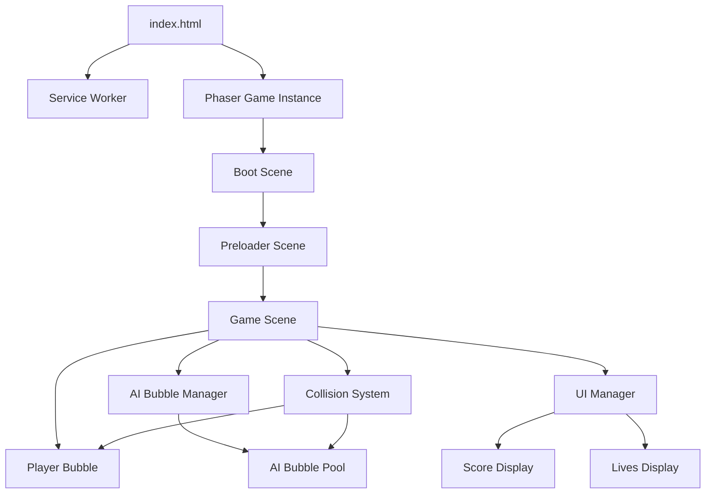

# Design Document: Bubble Consumption Game

## Overview

The bubble consumption game is a browser-based Progressive Web Application (PWA) built with ES2020 and the Phaser 3 game framework. The game implements a simple but engaging mechanic where players control a bubble that grows by consuming smaller bubbles while avoiding larger ones.

The architecture follows a client-side only approach with no server communication. All game logic, rendering, and state management execute in the browser. The Phaser framework provides the game loop, rendering pipeline, input handling, and physics system.

The visual design features a dark gray screen background with a black Game_World area where gameplay occurs. A white 3-pixel border surrounds the Game_World (800x600 inner dimensions). The HUD displays score and lives outside the Game_World in 24-point Arial/Helvetica font. When scenarios restart (from winning or losing a life), the game pauses for 2 seconds, clears the AI_Bubble list, resets the player bubble to 30 pixels, and spawns initial bubbles for the new scenario.

Key design goals:
- Smooth 30+ FPS gameplay on modern browsers
- Responsive input handling for both mouse and touch
- Accurate collision detection using circle-to-circle distance calculations
- Dynamic difficulty scaling based on player bubble size
- AI bubbles spawn at least 200 pixels away from the player
- Clean state management with AI_Bubble list clearing on scenario restart
- Offline-first PWA architecture with service worker caching

## Architecture

### High-Level Structure



### Technology Stack

- **Runtime**: ES2020 in modern browsers (Chrome 80+, Firefox 75+, Safari 13+)
- **Game Framework**: Phaser 3.60+ (provides game loop, rendering, input, physics)
- **PWA**: Service Worker API + Web App Manifest
- **Build**: No build step required (native ES modules)
- **Storage**: None required (no persistence between sessions)

### Visual Design

The game uses a layered visual approach:
- **Screen Background**: Dark gray (#808080) - the outer browser canvas
- **Game_World Background**: Black (#000000) - the 800x600 playable area
- **Game_World Border**: White (#FFFFFF) - 3-pixel thick border with 800x600 inner dimensions
- **HUD Elements**: Positioned outside Game_World, rendered in 24pt Arial/Helvetica
- **Bubbles**: Rendered within the black Game_World area

This creates a clear visual separation between the playable area and UI elements.

### Module Organization

```
/
├── index.html              # Entry point
├── manifest.json           # PWA manifest
├── service-worker.js       # Offline caching
├── src/
│   ├── main.js            # Phaser configuration and initialization
│   ├── scenes/
│   │   ├── BootScene.js       # Initial boot scene (loads logo)
│   │   ├── PreloaderScene.js  # Asset loading scene
│   │   └── GameScene.js       # Main game scene
│   ├── entities/
│   │   ├── Bubble.js          # Abstract base bubble class
│   │   ├── PlayerBubble.js    # Player-controlled bubble
│   │   └── AIBubble.js        # AI-controlled bubble
│   ├── systems/
│   │   ├── CollisionSystem.js # Collision detection and resolution
│   │   ├── SpawnSystem.js     # AI bubble spawning logic
│   │   └── MovementSystem.js  # Movement calculations
│   └── ui/
│       └── HUD.js         # Score and lives display
└── assets/
    ├── images/
    │   └── logo.png           # Game logo for preloader
    └── audio/
        ├── pop.wav            # Consumption sound effect
        ├── explosion.mp3      # Death sound effect
        └── fanfare.wav        # Level reset sound effect
```

## Components and Interfaces

### Main Game Configuration

The main.js file initializes the Phaser game instance with BootScene as the first scene.

```javascript
// main.js
import BootScene from './scenes/BootScene.js';
import PreloaderScene from './scenes/PreloaderScene.js';
import GameScene from './scenes/GameScene.js';

const config = {
  type: Phaser.AUTO,
  width: 800,
  height: 600,
  backgroundColor: '#808080',  // Dark gray screen background
  scene: [BootScene, PreloaderScene, GameScene],
  physics: {
    default: 'arcade',
    arcade: {
      debug: false
    }
  }
};

const game = new Phaser.Game(config);
```

Scene flow: BootScene → PreloaderScene → GameScene

### BootScene

Initial scene that loads the logo asset for the preloader.

```javascript
class BootScene extends Phaser.Scene {
  constructor() {
    super({ key: 'BootScene' });
  }

  preload() {
    // Load the logo that will be displayed in PreloaderScene
    this.load.image('logo', 'assets/images/logo.png');
  }

  create() {
    // Start the preloader scene
    this.scene.start('PreloaderScene');
  }
}
```

### PreloaderScene

Scene that displays the logo and loads all game assets.

```javascript
class PreloaderScene extends Phaser.Scene {
  constructor() {
    super({ key: 'PreloaderScene' });
  }

  preload() {
    // Display logo while loading
    const logo = this.add.image(400, 300, 'logo');
    logo.setOrigin(0.5);

    // Create loading bar
    const progressBar = this.add.graphics();
    const progressBox = this.add.graphics();
    progressBox.fillStyle(0x222222, 0.8);
    progressBox.fillRect(250, 350, 300, 30);

    // Update progress bar as assets load
    this.load.on('progress', (value) => {
      progressBar.clear();
      progressBar.fillStyle(0x4a90e2, 1);
      progressBar.fillRect(260, 360, 280 * value, 10);
    });

    this.load.on('complete', () => {
      progressBar.destroy();
      progressBox.destroy();
    });

    // Load sound effects
    this.load.audio('pop', 'assets/audio/pop.wav');
    this.load.audio('explosion', 'assets/audio/explosion.mp3');
    this.load.audio('fanfare', 'assets/audio/fanfare.wav');
  }

  create() {
    // Start the main game scene
    this.scene.start('GameScene');
  }
}
```

### Bubble (Abstract Base Class)

Abstract base class containing common functionality for all bubble entities.

```javascript
class Bubble {
  constructor(scene, x, y, size) {
    if (new.target === Bubble) {
      throw new Error('Bubble is an abstract class and cannot be instantiated directly');
    }
    this.scene = scene;
    this.x = x;
    this.y = y;
    this.size = size;  // diameter in pixels
    this.graphics = null;  // Phaser Graphics object
  }

  /**
   * Get radius for collision detection
   * @returns {number} Radius in pixels
   */
  getRadius() {
    return this.size / 2;
  }

  /**
   * Update bubble state (must be implemented by subclasses)
   * @param {number} delta - Time since last frame in ms
   */
  update(delta) {
    throw new Error('update() must be implemented by subclass');
  }

  /**
   * Render the bubble (must be implemented by subclasses)
   */
  render() {
    throw new Error('render() must be implemented by subclass');
  }

  /**
   * Check if position is within world boundaries
   * @param {number} x - X coordinate
   * @param {number} y - Y coordinate
   * @param {number} worldWidth - World width
   * @param {number} worldHeight - World height
   * @returns {boolean} True if within boundaries
   */
  isWithinBounds(x, y, worldWidth, worldHeight) {
    const radius = this.getRadius();
    return x - radius >= 0 && 
           x + radius <= worldWidth && 
           y - radius >= 0 && 
           y + radius <= worldHeight;
  }

  /**
   * Constrain position to world boundaries
   * @param {number} worldWidth - World width
   * @param {number} worldHeight - World height
   */
  constrainToBounds(worldWidth, worldHeight) {
    const radius = this.getRadius();
    this.x = Math.max(radius, Math.min(worldWidth - radius, this.x));
    this.y = Math.max(radius, Math.min(worldHeight - radius, this.y));
  }
}
```

### PlayerBubble

Represents the player-controlled bubble entity. Extends Bubble base class.

```javascript
class PlayerBubble extends Bubble {
  constructor(scene, x, y, size = 30) {
    super(scene, x, y, size);
    this.targetX = x;
    this.targetY = y;
  }

  /**
   * Calculate movement speed based on size (inversely proportional)
   * @returns {number} Speed in pixels per second
   */
  getSpeed() {
    return Math.max(50, 300 - (this.size * 2));
  }

  /**
   * Update position toward target, constrained by boundaries
   * @param {number} delta - Time since last frame in ms
   */
  update(delta) {
    const dt = delta / 1000;
    const dx = this.targetX - this.x;
    const dy = this.targetY - this.y;
    const distance = Math.sqrt(dx * dx + dy * dy);
    
    if (distance > 1) {
      const speed = this.getSpeed();
      const moveDistance = speed * dt;
      const ratio = Math.min(moveDistance / distance, 1);
      
      this.x += dx * ratio;
      this.y += dy * ratio;
      
      // Constrain to world boundaries (800x600)
      this.constrainToBounds(800, 600);
    }
  }

  /**
   * Set movement target from input
   * @param {number} x - Target x coordinate
   * @param {number} y - Target y coordinate
   */
  setTarget(x, y) {
    this.targetX = x;
    this.targetY = y;
  }

  /**
   * Grow bubble by consuming another bubble
   * @param {number} consumedSize - Size of consumed bubble
   */
  grow(consumedSize) {
    const growth = Math.floor(Math.sqrt(consumedSize));
    this.size = Math.min(100, this.size + growth);
  }

  /**
   * Render the bubble
   */
  render() {
    // Draw gray circle with blue border
    if (!this.graphics) {
      this.graphics = this.scene.add.graphics();
    }
    
    this.graphics.clear();
    this.graphics.fillStyle(0x808080, 1);  // Gray fill
    this.graphics.fillCircle(this.x, this.y, this.getRadius());
    this.graphics.lineStyle(2, 0x4a90e2, 1);  // Blue border
    this.graphics.strokeCircle(this.x, this.y, this.getRadius());
  }
}
```

### AIBubble

Represents an AI-controlled bubble entity. Extends Bubble base class.

```javascript
class AIBubble extends Bubble {
  constructor(scene, x, y, size, velocityX, velocityY) {
    super(scene, x, y, size);
    this.velocityX = velocityX;  // pixels per second
    this.velocityY = velocityY;  // pixels per second
    this.color = this.generatePastelColor();
  }

  /**
   * Generate a random pastel color
   * @returns {number} Hex color value
   */
  generatePastelColor() {
    const hue = Math.random() * 360;
    const saturation = 25 + Math.random() * 25;  // 25-50%
    const lightness = 70 + Math.random() * 15;   // 70-85%
    return this.hslToHex(hue, saturation, lightness);
  }

  /**
   * Convert HSL to hex color
   * @param {number} h - Hue (0-360)
   * @param {number} s - Saturation (0-100)
   * @param {number} l - Lightness (0-100)
   * @returns {number} Hex color value
   */
  hslToHex(h, s, l) {
    s /= 100;
    l /= 100;
    const c = (1 - Math.abs(2 * l - 1)) * s;
    const x = c * (1 - Math.abs((h / 60) % 2 - 1));
    const m = l - c / 2;
    let r = 0, g = 0, b = 0;
    
    if (h < 60) { r = c; g = x; b = 0; }
    else if (h < 120) { r = x; g = c; b = 0; }
    else if (h < 180) { r = 0; g = c; b = x; }
    else if (h < 240) { r = 0; g = x; b = c; }
    else if (h < 300) { r = x; g = 0; b = c; }
    else { r = c; g = 0; b = x; }
    
    const toHex = (val) => {
      const hex = Math.round((val + m) * 255).toString(16);
      return hex.length === 1 ? '0' + hex : hex;
    };
    
    return parseInt(`0x${toHex(r)}${toHex(g)}${toHex(b)}`);
  }

  /**
   * Update position and handle boundary bouncing
   * @param {number} delta - Time since last frame in ms
   */
  update(delta) {
    const dt = delta / 1000;
    this.x += this.velocityX * dt;
    this.y += this.velocityY * dt;

    // Bounce off boundaries
    const radius = this.getRadius();
    if (this.x - radius < 0 || this.x + radius > 800) {
      this.velocityX *= -1;
      this.constrainToBounds(800, 600);
    }
    if (this.y - radius < 0 || this.y + radius > 600) {
      this.velocityY *= -1;
      this.constrainToBounds(800, 600);
    }
  }

  /**
   * Render the bubble
   */
  render() {
    // Draw colored circle with no border
    if (!this.graphics) {
      this.graphics = this.scene.add.graphics();
    }
    
    this.graphics.clear();
    this.graphics.fillStyle(this.color, 1);
    this.graphics.fillCircle(this.x, this.y, this.getRadius());
  }
}
```

### CollisionSystem

Handles collision detection and resolution between bubbles.

```javascript
class CollisionSystem {
  /**
   * Check collision between two bubbles
   * @param {PlayerBubble|AIBubble} bubble1
   * @param {AIBubble} bubble2
   * @returns {boolean} True if colliding
   */
  static checkCollision(bubble1, bubble2) {
    const dx = bubble1.x - bubble2.x;
    const dy = bubble1.y - bubble2.y;
    const distance = Math.sqrt(dx * dx + dy * dy);
    const minDistance = bubble1.getRadius() + bubble2.getRadius();
    return distance < minDistance;
  }

  /**
   * Process collision between player and AI bubble
   * @param {PlayerBubble} player
   * @param {AIBubble} aiBubble
   * @returns {Object} Result with action and data
   */
  static resolveCollision(player, aiBubble) {
    if (player.size > aiBubble.size) {
      return {
        action: 'consume',
        score: aiBubble.size,
        growth: Math.floor(Math.sqrt(aiBubble.size))
      };
    } else {
      return {
        action: 'death',
        score: 0,
        growth: 0
      };
    }
  }
}
```

### SpawnSystem

Manages AI bubble spawning with dynamic difficulty scaling.

```javascript
class SpawnSystem {
  constructor(scene, worldWidth, worldHeight, initialBubbleCount = 10) {
    this.scene = scene;
    this.worldWidth = worldWidth;
    this.worldHeight = worldHeight;
    this.targetBubbleCount = initialBubbleCount;  // Increases by 2 each scene reset
  }

  /**
   * Increase target bubble count for next scene
   */
  incrementDifficulty() {
    this.targetBubbleCount += 2;
  }

  /**
   * Get current target bubble count
   * @returns {number} Target number of bubbles for current scene
   */
  getTargetCount() {
    return this.targetBubbleCount;
  }

  /**
   * Calculate size range for new AI bubbles based on player size
   * @param {number} playerSize - Current player bubble size
   * @returns {Object} Min and max size values
   */
  calculateSizeRange(playerSize) {
    return {
      min: Math.max(10, Math.floor(playerSize * 0.5)),
      max: Math.min(70, Math.floor(playerSize * 1.5))
    };
  }

  /**
   * Spawn a new AI bubble with balanced size distribution
   * @param {number} playerSize - Current player bubble size
   * @param {number} playerX - Player bubble X position
   * @param {number} playerY - Player bubble Y position
   * @param {number} currentCount - Current number of AI bubbles
   * @returns {AIBubble|null} New bubble or null if at capacity
   */
  spawnBubble(playerSize, playerX, playerY, currentCount) {
    if (currentCount >= this.targetBubbleCount) {
      return null;
    }

    const sizeRange = this.calculateSizeRange(playerSize);
    const size = this.generateBalancedSize(sizeRange, playerSize);
    const position = this.getRandomPosition(size, playerX, playerY);
    const velocity = this.getRandomVelocity();

    return new AIBubble(
      this.scene,
      position.x,
      position.y,
      size,
      velocity.x,
      velocity.y
    );
  }

  /**
   * Generate size with balanced distribution (30% smaller, 50% similar, 20% larger)
   * @param {Object} sizeRange - Min and max size
   * @param {number} playerSize - Current player size
   * @returns {number} Generated size
   */
  generateBalancedSize(sizeRange, playerSize) {
    const roll = Math.random();
    if (roll < 0.3) {
      // 30% smaller than player
      return Math.floor(Math.random() * (playerSize - sizeRange.min) + sizeRange.min);
    } else if (roll < 0.8) {
      // 50% similar to player
      const variance = playerSize * 0.2;
      return Math.floor(Math.random() * variance * 2 + playerSize - variance);
    } else {
      // 20% larger than player
      return Math.floor(Math.random() * (sizeRange.max - playerSize) + playerSize);
    }
  }

  /**
   * Get random spawn position avoiding edges and player bubble
   * @param {number} size - Bubble size
   * @param {number} playerX - Player bubble X position
   * @param {number} playerY - Player bubble Y position
   * @returns {Object} x and y coordinates
   */
  getRandomPosition(size, playerX, playerY) {
    const margin = size / 2 + 10;
    const minDistanceFromPlayer = 200;  // Minimum 200 pixels from player center
    let x, y, distance;
    let attempts = 0;
    const maxAttempts = 100;
    
    do {
      x = margin + Math.random() * (this.worldWidth - margin * 2);
      y = margin + Math.random() * (this.worldHeight - margin * 2);
      const dx = x - playerX;
      const dy = y - playerY;
      distance = Math.sqrt(dx * dx + dy * dy);
      attempts++;
    } while (distance < minDistanceFromPlayer && attempts < maxAttempts);
    
    return { x, y };
  }

  /**
   * Get random velocity vector
   * @returns {Object} x and y velocity components
   */
  getRandomVelocity() {
    const speed = 50 + Math.random() * 100;  // 50-150 px/s
    const angle = Math.random() * Math.PI * 2;
    return {
      x: Math.cos(angle) * speed,
      y: Math.sin(angle) * speed
    };
  }
}
```

### GameScene

Main Phaser scene that orchestrates all game systems.

```javascript
class GameScene extends Phaser.Scene {
  constructor() {
    super({ key: 'GameScene' });
    this.worldWidth = 800;
    this.worldHeight = 600;
    this.lives = 3;
    this.score = 0;
    this.playerBubble = null;
    this.aiBubbles = [];
    this.spawnSystem = null;
    this.hud = null;
    this.sounds = {};
    this.currentBubbleCount = 10;  // Tracks bubble count across scene resets
    this.gameWorldBackground = null;  // Black background for Game_World
    this.gameWorldBorder = null;  // White border for Game_World
    this.isPaused = false;  // Track pause state for scenario restart
  }

  init(data) {
    // Preserve bubble count across scene restarts
    if (data && data.bubbleCount !== undefined) {
      this.currentBubbleCount = data.bubbleCount;
    }
  }

  create() {
    // Initialize game state
    this.lives = 3;
    this.score = 0;
    
    // Create black background for Game_World
    this.gameWorldBackground = this.add.rectangle(
      0, 
      0, 
      this.worldWidth, 
      this.worldHeight, 
      0x000000  // Black
    );
    this.gameWorldBackground.setOrigin(0, 0);
    
    // Create white border around Game_World (3px thickness, 800x600 inner dimensions)
    this.gameWorldBorder = this.add.graphics();
    this.gameWorldBorder.lineStyle(3, 0xFFFFFF, 1);  // 3px white border
    this.gameWorldBorder.strokeRect(0, 0, this.worldWidth, this.worldHeight);
    
    // Load sound effects
    this.sounds.pop = this.sound.add('pop');
    this.sounds.explosion = this.sound.add('explosion');
    this.sounds.fanfare = this.sound.add('fanfare');
    
    // Create player bubble at center
    this.playerBubble = new PlayerBubble(
      this,
      this.worldWidth / 2,
      this.worldHeight / 2,
      30
    );

    // Initialize spawn system with current bubble count
    this.spawnSystem = new SpawnSystem(
      this,
      this.worldWidth,
      this.worldHeight,
      this.currentBubbleCount
    );

    // Spawn initial AI bubbles
    this.spawnInitialBubbles();

    // Setup input handlers
    this.setupInput();

    // Create HUD
    this.hud = new HUD(this);
  }

  update(time, delta) {
    // Skip updates if paused
    if (this.isPaused) {
      return;
    }
    
    // Update player bubble
    this.playerBubble.update(delta);

    // Update AI bubbles
    this.aiBubbles.forEach(bubble => bubble.update(delta));

    // Check collisions
    this.checkCollisions();

    // Maintain bubble count
    this.maintainBubbleCount();

    // Check win condition
    if (this.playerBubble.size >= 100) {
      this.handleWin();
    }

    // Render all entities
    this.render();
  }

  checkCollisions() {
    for (let i = this.aiBubbles.length - 1; i >= 0; i--) {
      const aiBubble = this.aiBubbles[i];
      if (CollisionSystem.checkCollision(this.playerBubble, aiBubble)) {
        const result = CollisionSystem.resolveCollision(
          this.playerBubble,
          aiBubble
        );
        
        if (result.action === 'consume') {
          this.score += result.score;
          this.playerBubble.grow(aiBubble.size);
          this.aiBubbles.splice(i, 1);
          this.sounds.pop.play();
        } else if (result.action === 'death') {
          this.sounds.explosion.play();
          this.handleDeath();
          break;
        }
      }
    }
  }

  handleDeath() {
    this.lives--;
    if (this.lives > 0) {
      this.sounds.fanfare.play();
      this.currentBubbleCount += 2;  // Increase difficulty
      this.restartScenarioWithPause();
    } else {
      this.handleGameOver();
    }
  }

  handleWin() {
    this.sounds.fanfare.play();
    this.currentBubbleCount += 2;  // Increase difficulty
    this.restartScenarioWithPause();
  }

  /**
   * Restart scenario with 2-second pause and player size reset
   */
  restartScenarioWithPause() {
    this.isPaused = true;
    
    // Wait 2 seconds before restarting
    this.time.delayedCall(2000, () => {
      this.isPaused = false;
      // Reset player bubble size to 30 pixels
      this.playerBubble.size = 30;
      // Clear AI_Bubble list before restart
      this.aiBubbles = [];
      this.spawnInitialBubbles();
      this.scene.restart({ bubbleCount: this.currentBubbleCount });
    });
  }

  handleGameOver() {
    // Display final score and restart option
    this.scene.pause();
    this.hud.showGameOver(this.score);
  }

  setupInput() {
    this.input.on('pointermove', (pointer) => {
      if (pointer.isDown) {
        this.playerBubble.setTarget(pointer.x, pointer.y);
      }
    });

    this.input.on('pointerdown', (pointer) => {
      this.playerBubble.setTarget(pointer.x, pointer.y);
    });
  }

  spawnInitialBubbles() {
    // Clear AI_Bubble list to ensure clean state
    this.aiBubbles = [];
    
    const targetCount = this.spawnSystem.getTargetCount();
    for (let i = 0; i < targetCount; i++) {
      const bubble = this.spawnSystem.spawnBubble(
        this.playerBubble.size,
        this.playerBubble.x,
        this.playerBubble.y,
        this.aiBubbles.length
      );
      if (bubble) {
        this.aiBubbles.push(bubble);
      }
    }
  }

  maintainBubbleCount() {
    const targetCount = this.spawnSystem.getTargetCount();
    while (this.aiBubbles.length < targetCount) {
      const bubble = this.spawnSystem.spawnBubble(
        this.playerBubble.size,
        this.playerBubble.x,
        this.playerBubble.y,
        this.aiBubbles.length
      );
      if (bubble) {
        this.aiBubbles.push(bubble);
      }
    }
  }

  render() {
    // Clear previous frame
    // Render all bubbles
    this.aiBubbles.forEach(bubble => bubble.render());
    this.playerBubble.render();
    this.hud.render(this.score, this.lives);
  }
}
```

### HUD

Manages the heads-up display for score and lives.

```javascript
class HUD {
  constructor(scene) {
    this.scene = scene;
    this.scoreText = null;
    this.livesText = null;
    this.gameOverText = null;
    this.createUI();
  }

  createUI() {
    // Display score and lives outside Game_World in 24pt Arial/Helvetica
    this.scoreText = this.scene.add.text(10, 10, 'Score: 0', {
      fontSize: '24pt',
      fontFamily: 'Arial, Helvetica, sans-serif',
      fill: '#ffffff'
    });

    this.livesText = this.scene.add.text(10, 40, 'Lives: 3', {
      fontSize: '24pt',
      fontFamily: 'Arial, Helvetica, sans-serif',
      fill: '#ffffff'
    });
  }

  render(score, lives) {
    this.scoreText.setText(`Score: ${score}`);
    this.livesText.setText(`Lives: ${lives}`);
  }

  showGameOver(finalScore) {
    this.gameOverText = this.scene.add.text(
      400,
      300,
      `Game Over\nFinal Score: ${finalScore}\nClick to Restart`,
      {
        fontSize: '32px',
        fill: '#ffffff',
        align: 'center'
      }
    );
    this.gameOverText.setOrigin(0.5);

    this.scene.input.once('pointerdown', () => {
      this.scene.scene.restart();
    });
  }
}
```

### PWA Configuration

Service worker for offline caching:

```javascript
// service-worker.js
const CACHE_NAME = 'bubble-game-v1';
const urlsToCache = [
  '/',
  '/index.html',
  '/src/main.js',
  '/src/scenes/BootScene.js',
  '/src/scenes/PreloaderScene.js',
  '/src/scenes/GameScene.js',
  '/src/entities/Bubble.js',
  '/src/entities/PlayerBubble.js',
  '/src/entities/AIBubble.js',
  '/src/systems/CollisionSystem.js',
  '/src/systems/SpawnSystem.js',
  '/src/systems/MovementSystem.js',
  '/src/ui/HUD.js',
  '/assets/images/logo.png',
  '/assets/audio/pop.wav',
  '/assets/audio/explosion.mp3',
  '/assets/audio/fanfare.wav',
  'https://cdn.jsdelivr.net/npm/phaser@3.60.0/dist/phaser.min.js'
];

self.addEventListener('install', (event) => {
  event.waitUntil(
    caches.open(CACHE_NAME)
      .then((cache) => cache.addAll(urlsToCache))
  );
});

self.addEventListener('fetch', (event) => {
  event.respondWith(
    caches.match(event.request)
      .then((response) => response || fetch(event.request))
  );
});
```

Web app manifest:

```json
{
  "name": "Bubble Consumption Game",
  "short_name": "Bubbles",
  "description": "Grow your bubble by consuming smaller ones",
  "start_url": "/",
  "display": "standalone",
  "background_color": "#808080",
  "theme_color": "#4a90e2",
  "icons": [
    {
      "src": "/icon-192.png",
      "sizes": "192x192",
      "type": "image/png"
    },
    {
      "src": "/icon-512.png",
      "sizes": "512x512",
      "type": "image/png"
    }
  ]
}
```

## Data Models

### Game State

The game state is managed entirely within the GameScene instance:

```javascript
{
  lives: number,              // Current lives remaining (0-3)
  score: number,              // Current score (sum of consumed bubble sizes)
  playerBubble: PlayerBubble, // Player entity
  aiBubbles: AIBubble[],      // Array of AI entities
  worldWidth: 800,            // Game world width in pixels
  worldHeight: 600,           // Game world height in pixels
  isGameOver: boolean,        // Game over state flag
  currentBubbleCount: number, // Current target bubble count (starts at 10, +2 per reset)
  gameWorldBackground: object, // Black background rectangle for Game_World
  gameWorldBorder: object,    // White border graphics for Game_World (3px thickness)
  isPaused: boolean,          // Pause state for scenario restart (2-second delay)
  sounds: {                   // Sound effect references
    pop: object,              // Pop sound for consumption
    explosion: object,        // Explosion sound for death
    fanfare: object           // Fanfare sound for level reset
  }
}
```

### Bubble Entity

All bubbles (PlayerBubble and AIBubble) inherit from the abstract Bubble base class with common properties:

```javascript
{
  x: number,          // X position in pixels
  y: number,          // Y position in pixels
  size: number,       // Diameter in pixels
  graphics: object,   // Phaser Graphics object reference
  scene: object       // Reference to Phaser scene
}
```

PlayerBubble additional properties:

```javascript
{
  targetX: number,    // Target X position from input
  targetY: number     // Target Y position from input
}
```

AIBubble additional properties:

```javascript
{
  velocityX: number,  // X velocity in pixels per second
  velocityY: number,  // Y velocity in pixels per second
  color: number       // Hex color value
}
```

### Collision Result

Result object from collision resolution:

```javascript
{
  action: 'consume' | 'death',  // Outcome of collision
  score: number,                // Score to add (0 for death)
  growth: number                // Size growth for player (0 for death)
}
```

### Spawn Configuration

Configuration for AI bubble spawning:

```javascript
{
  targetBubbleCount: number,  // Target number of bubbles (starts at 10, increases by 2 per reset)
  sizeRange: {
    min: number,              // Minimum spawn size (50% of player size)
    max: number               // Maximum spawn size (150% of player size)
  }
}
```


## Correctness Properties

A property is a characteristic or behavior that should hold true across all valid executions of a system-essentially, a formal statement about what the system should do. Properties serve as the bridge between human-readable specifications and machine-verifiable correctness guarantees.

### Property Reflection

After analyzing all acceptance criteria, I identified several areas of redundancy:

- Collision detection properties (10.1, 10.2, 10.3) all describe the same mathematical relationship and can be combined into one comprehensive property
- Input handling properties (8.1, 8.2) both test the same behavior (setting movement target) and can be combined
- AI bubble size constraints appear in multiple places (4.4, 5.3, 11.1) and can be consolidated
- Boundary constraint properties (2.3, 2.4) describe related behavior that can be tested together
- Score tracking (3.2, 6.4) both verify score accumulation and can be combined

The following properties represent the unique, non-redundant correctness guarantees for the system.

### Property 1: Player Bubble Boundary Constraint

For any player bubble position and movement input, the player bubble's position should always remain within the game world boundaries (0 to 800 pixels width, 0 to 600 pixels height), and movement toward a boundary should be prevented when at the edge.

**Validates: Requirements 2.3, 2.4**

### Property 2: Speed Inversely Proportional to Size

For any player bubble size, the movement speed should be inversely proportional to the size, such that larger bubbles move slower than smaller bubbles.

**Validates: Requirements 2.2**

### Property 3: Input Sets Movement Target

For any input event (mouse or touch) with coordinates (x, y), the player bubble's target position should be set to (x, y).

**Validates: Requirements 2.1, 8.1, 8.2**

### Property 4: Collision Detection by Distance

For any two bubbles with positions (x1, y1) and (x2, y2) and radii r1 and r2, a collision should be detected if and only if the distance between centers is less than r1 + r2.

**Validates: Requirements 10.1, 10.2, 10.3**

### Property 5: Consumption Increases Score

For any collision where the player bubble is larger than an AI bubble, the AI bubble should be removed and the score should increase by the size of the consumed AI bubble.

**Validates: Requirements 3.2, 6.4**

### Property 6: Growth Calculation

For any consumption event where the player consumes an AI bubble of size S, the player's new size should equal min(100, oldSize + floor(sqrt(S))).

**Validates: Requirements 3.4**

### Property 7: Area Conservation

For any bubble consumption event, the total area (sum of πr² for all bubbles) before consumption should equal the total area after consumption.

**Validates: Requirements 3.5**

### Property 8: Death on Larger Collision

For any collision where the AI bubble size is greater than or equal to the player bubble size, the player should lose one life and the scene should restart.

**Validates: Requirements 3.3**

### Property 9: Life Decrement

For any game state with N lives (N > 0), when a life is lost, the restarted game should have N-1 lives.

**Validates: Requirements 1.2**

### Property 10: Win Condition Reset

For any game state where the player bubble reaches size 100, the game should restart with the scenario reset.

**Validates: Requirements 1.4**

### Property 11: AI Bubble Boundary Bouncing

For any AI bubble that reaches a game world boundary, its velocity component perpendicular to that boundary should reverse direction (multiply by -1).

**Validates: Requirements 4.3**

### Property 12: AI Bubble Constant Velocity

For any AI bubble between boundary collisions, its velocity vector should remain constant across all update frames.

**Validates: Requirements 4.2**

### Property 13: AI Bubble Count Invariant

For any game state during active gameplay in a scene, the number of AI bubbles should equal the target bubble count for that scene (starting at 10, increasing by 2 after each reset).

**Validates: Requirements 4.5, 4.6, 4.7**

### Property 14: AI Bubble Spawn Position

For any newly spawned AI bubble with size S, its position should be within the game world boundaries with at least S/2 pixels margin from each edge.

**Validates: Requirements 4.1**

### Property 15: AI Bubble Size Range

For any AI bubble in the game, its size should be between 10 and 70 pixels (inclusive).

**Validates: Requirements 4.4, 5.3**

### Property 16: Dynamic Size Scaling

For any player bubble size P, newly spawned AI bubbles should have sizes in the range [max(10, 0.5*P), min(70, 1.5*P)].

**Validates: Requirements 11.1, 11.2**

### Property 17: Smaller Bubble Distribution

For any game state with N AI bubbles, at least floor(0.3*N) bubbles should have size less than the player bubble size.

**Validates: Requirements 11.3**

### Property 18: Larger Bubble Distribution

For any game state with N AI bubbles, at least floor(0.2*N) bubbles should have size greater than the player bubble size.

**Validates: Requirements 11.4**

### Property 19: Bubble Radius Rendering

For any bubble with size S, the rendered circle should have radius equal to S/2.

**Validates: Requirements 5.1**

### Property 20: Score Always Visible

For any game state, the score display element should exist in the DOM and be visible.

**Validates: Requirements 1.5**

### Property 21: Game Over Display

For any game state where lives equal 0, the final score should be displayed and a restart option should be available.

**Validates: Requirements 6.2, 6.3**

### Property 22: Continuous Movement

For any game state where input is held down (mouse button or touch), the player bubble should continue moving toward the target position across multiple frames.

**Validates: Requirements 8.3**

### Property 23: Input Coordinate Normalization

For any screen size and input coordinates, the normalized game world coordinates should map correctly to the 800x600 game world regardless of display resolution.

**Validates: Requirements 8.4**

### Property 24: Pop Sound on Consumption

For any collision where the player bubble consumes a smaller AI bubble, the "pop" sound effect should be played.

**Validates: Requirements 12.1**

### Property 25: Explosion Sound on Death

For any collision where the AI bubble size is greater than or equal to the player bubble size, the "explosion" sound effect should be played.

**Validates: Requirements 12.2**

### Property 26: Fanfare Sound on Level Reset

For any scene reset event (from winning or losing a life), the "fanfare" sound effect should be played.

**Validates: Requirements 12.3**

### Property 27: Progressive Bubble Count

For any scene reset N (where N >= 1), the target bubble count should equal 10 + (2 * N).

**Validates: Requirements 4.6**

### Property 28: AI Bubble Spawn Distance from Player

For any newly spawned AI bubble with center at (x, y) and player bubble center at (px, py), the distance between centers should be at least 200 pixels.

**Validates: Requirements 4.2**

### Property 29: Scenario Restart Pause Duration

For any scenario restart event (from winning or losing a life), the game should pause for exactly 2 seconds before resuming.

**Validates: Requirements 1.6**

### Property 30: Player Size Reset on Scenario Restart

For any scenario restart event, after the 2-second pause completes, the player bubble size should be reset to 30 pixels.

**Validates: Requirements 1.7**

### Property 31: Screen Background Color

For any game state, the screen background should be rendered as dark gray (#808080).

**Validates: Requirements 5.4**

### Property 32: Game World Background Color

For any game state, the Game_World background should be rendered as black (#000000).

**Validates: Requirements 5.5**

### Property 33: HUD Font Specification

For any game state, the score and lives count should be displayed in 24 point Arial or Helvetica font.

**Validates: Requirements 6.3**

### Property 34: AI Bubble List Cleared on Restart

For any scenario restart event (from winning or losing a life), the AI_Bubble list should be empty before spawning new bubbles for the new scenario.

**Validates: Requirements 4.9**

### Property 35: Game World Border Rendering

For any game state, the Game_World should have a white border with 3 pixels thickness and inner dimensions of 800x600 pixels.

**Validates: Requirements 5.6**

## Error Handling

### Input Validation

- Mouse/touch coordinates outside game world bounds: Clamp to nearest valid position within boundaries
- Invalid bubble sizes (negative, zero, or exceeding limits): Reject spawn attempts and log warning
- Collision detection with null/undefined bubbles: Skip collision check and continue

### Game State Errors

- Lives count becomes negative: Force to 0 and trigger game over
- Score becomes negative: Reset to 0 and log error
- Player bubble size exceeds 100: Clamp to 100 and trigger win condition
- AI bubble count exceeds maximum: Stop spawning until count drops below threshold

### PWA Errors

- Service worker registration failure: Log error but allow game to continue (graceful degradation)
- Cache storage failure: Fall back to network requests
- Manifest parsing error: Log error but allow game to function as regular web app

### Rendering Errors

- Graphics context lost: Attempt to recreate context, restart scene if necessary
- Invalid color values: Fall back to default pastel color
- Bubble position NaN/Infinity: Reset bubble to random valid position

### Performance Degradation

- Frame rate drops below 20 FPS: Log warning (no automatic action, as this is hardware-dependent)
- Too many collision checks per frame: Implement spatial partitioning if needed (optimization, not error)

## Testing Strategy

### Dual Testing Approach

The testing strategy employs both unit tests and property-based tests to ensure comprehensive coverage:

- **Unit tests**: Verify specific examples, edge cases, error conditions, and integration points
- **Property-based tests**: Verify universal properties across randomized inputs

Unit tests focus on concrete scenarios like initial game state, specific collision outcomes, and boundary conditions. Property-based tests validate that correctness properties hold across hundreds of randomized test cases, catching edge cases that might be missed by example-based testing.

### Property-Based Testing Configuration

We will use **fast-check** (for JavaScript/ES2020) as the property-based testing library. Each property test will:

- Run a minimum of 100 iterations with randomized inputs
- Include a comment tag referencing the design document property
- Tag format: `// Feature: bubble-consumption-game, Property N: [property description]`

Example property test structure:

```javascript
import fc from 'fast-check';
import { describe, it } from 'vitest';

describe('Bubble Consumption Game Properties', () => {
  it('Property 4: Collision Detection by Distance', () => {
    // Feature: bubble-consumption-game, Property 4: Collision Detection by Distance
    fc.assert(
      fc.property(
        fc.record({
          x1: fc.float({ min: 0, max: 800 }),
          y1: fc.float({ min: 0, max: 600 }),
          r1: fc.float({ min: 5, max: 50 }),
          x2: fc.float({ min: 0, max: 800 }),
          y2: fc.float({ min: 0, max: 600 }),
          r2: fc.float({ min: 5, max: 50 })
        }),
        ({ x1, y1, r1, x2, y2, r2 }) => {
          const distance = Math.sqrt((x2 - x1) ** 2 + (y2 - y1) ** 2);
          const collision = CollisionSystem.checkCollision(
            { x: x1, y: y1, getRadius: () => r1 },
            { x: x2, y: y2, getRadius: () => r2 }
          );
          return collision === (distance < r1 + r2);
        }
      ),
      { numRuns: 100 }
    );
  });
});
```

### Unit Testing Focus Areas

Unit tests should cover:

1. **Initial State Examples**
   - Game starts with 3 lives (Requirement 1.1)
   - Player bubble starts at center with size 30 (Requirement 6.1)
   - Player bubble is gray with blue border (Requirement 5.2)
   - BootScene loads logo and transitions to PreloaderScene
   - PreloaderScene displays logo, loads sounds, and transitions to GameScene
   - First scene spawns exactly 10 AI bubbles (Requirement 4.5)
   - Sound effects are loaded and playable (Requirement 12.4)
   - Game_World has white 3-pixel border with 800x600 inner dimensions (Requirement 5.6)

2. **Edge Cases**
   - Player bubble at exact boundary position
   - Collision with exactly equal sizes
   - Consumption that would exceed size 100
   - Last life lost triggers game over (Requirement 1.3)
   - Empty AI bubble array handling
   - AI_Bubble list is cleared before spawning on restart (Requirement 4.9)

3. **PWA Configuration**
   - Service worker registration succeeds (Requirement 7.1)
   - Manifest file exists and is valid (Requirement 7.2)
   - Required assets are cached (Requirement 7.5)
   - Game functions offline (Requirement 7.4)

4. **Integration Points**
   - GameScene orchestrates all systems correctly
   - Input events propagate to player bubble
   - Collision triggers appropriate game state changes
   - HUD updates reflect game state changes

5. **Error Conditions**
   - Invalid bubble sizes are rejected
   - Negative lives are handled
   - Graphics context loss recovery

### Test Organization

```
tests/
├── unit/
│   ├── scenes/
│   │   ├── BootScene.test.js
│   │   ├── PreloaderScene.test.js
│   │   └── GameScene.test.js
│   ├── entities/
│   │   ├── Bubble.test.js
│   │   ├── PlayerBubble.test.js
│   │   └── AIBubble.test.js
│   ├── systems/
│   │   ├── CollisionSystem.test.js
│   │   ├── SpawnSystem.test.js
│   │   └── MovementSystem.test.js
│   ├── scenes/
│   │   └── GameScene.test.js
│   └── pwa/
│       ├── service-worker.test.js
│       └── manifest.test.js
└── properties/
    ├── collision.properties.test.js
    ├── movement.properties.test.js
    ├── spawning.properties.test.js
    ├── consumption.properties.test.js
    └── balance.properties.test.js
```

### Testing Tools

- **Test Runner**: Vitest (fast, ESM-native, Vite-compatible)
- **Property Testing**: fast-check (mature JavaScript PBT library)
- **Mocking**: Vitest built-in mocking for Phaser APIs
- **Coverage**: Vitest coverage with c8

### Continuous Testing

- Run unit tests on every commit
- Run property tests (100 iterations) on every commit
- Run extended property tests (1000 iterations) nightly
- Maintain minimum 80% code coverage
- All tests must pass before merging

The design now includes 35 correctness properties covering all testable acceptance criteria.

